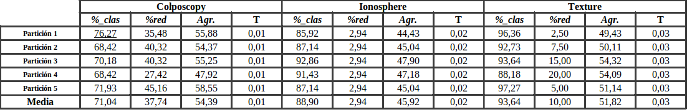
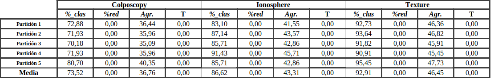
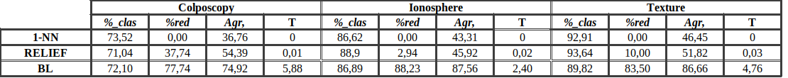

---
title: "Práctica 1b: APC"
author: [José Javier Alonso Ramos]
dni: "77766199-W"
date: "Curso: 2018 - 2019"
email: "jjavier.ar98@gmail.com"
group: "Grupo: 2"
horario: "Horario prácticas: Miércoles 17:30 - 19:30"
subject: "Markdown"
keywords: [Markdown, Example]
subtitle: "Técnicas de Búsqueda Local y Algoritmos Greedy para el Problema del Aprendizaje de Pesos en Características"
lang: "es"
titlepage: true
titlepage-rule-height: 1
logo: "../img/logoUGR/3.png"
logo-width: 300
toc: TRUE
toc-own-page: TRUE
titlepage-color: e0fbff
titlepage-text-color: 110406
...

La práctica ha sido realizada en python. Usar python3 como intérprete; si es posible, python3.6.  

# Aloritmos considerados  
* Greedy RELIEF  
* Local Search  
* 1-NN  

# Descripción del problema  
Dada una **población**, nos encontramos una serie de _n_ **elementos** por los que está formada, teniendo cada uno de ellos _x_ **características** según las cuales se les **clasifica** en una determinada clase _c_ perteneciente a un conjunto de clases _C_.  

Nuestro problema comprende la situación de clasificación de un nuevo elemento insertado en la población con la tara que supone no saber el criterio, según el cual, se clasifica.  

Para llevar a cabo esta tarea crearemos un sistema clasificador automático que analizará un subconjunto de la población escogido de manera que sea representativo respecto a la población al que llamaremos **muestra**. Aprenderemos a partir de las características de los elementos que conforman la muestra y sus clasificaciones una manera de clasificar el nuevo elemento correctamente con una fiabilidad suficientemente alta.  

Es un problema de **aprendizaje supervisado** ya que cuando entrenamos a nuestro sistema clasificador corroboraremos los resultados obtenidos con la clase real a la que pertenece el elemento, pudiendo así variar nuestras decisiones en pos de mejorar nuestro clasificador.  
El método empleado para aprender a clasificar será decisivo en la calidad, coste requerido y velocidad de la clasificación.  

\vfill
\vskip 10em
\vfill

# Elementos comunes a todos algoritmos implementados  

## Módulos importados y para qué han sido utilizados:  
* **arff** (de _scipy.io_): este módulo nos permite leer los archivos con extensión _.arff_ de datos de población.
* **numpy**: nos permite trabajar de forma cómoda con vectores y matrices a parte de proporcionar una serie de funciones matemáticas como _valor absoluto_, _media_, _distancia euclídea_, _generación de números aleatorios_, _distribución normal y uniforme_, _truncamiento de valores a un determinado rango_, y un largo etcétera.
* **pandas**: nos permite trabajar de forma cómoda con conjuntos de datos y crear tablas entre otras cosas. En la práctica lo usamos para transformar los datos leídos del fichero arff a una matriz.
* **KDTree** (de _sklearn.neighbors_): creamos un arbol con un determinado conjunto de datos (_conjunto1_) al que, pasándole un segundo conjunto (_conjunto2_ - que puede ser el mismo que el primero), nos devuelve _k_ elementos del conjunto1 en orden del más cercano al más lejano a cada elemento del conjunto2.
* **StratifiedKFold** (de _sklearn.model\_selection_): en la práctica se especifica que particionemos los datos leídos en 5 conjuntos del 20% de manera que las etiquetas se mantengan proporcionales al conunto original. Este módulo nos permite hacer esto además de manera aleatoria y mezclando los datos en los subconjuntos.
* **MinMaxScaler** (de _sklearn.preprocessing_): nos permite escalar los valores de las carácterísticas de los elementos al rango [1,0]
* **time** (de _time_): nos permite calcular el tiempo de ejecución de los ditintos algoritmos.
* **PrettyTable** (de _prettytable_): para imrimir los resultados obtenidos por los algoritmos de forma ordenada en tablas.
* **matplotlib.pyplot**: nos permite hacer gráficas

## Funciones auxiliares:  
* **byte2string(x)**: cuando leemos el conjunto de datos _x_ transformamos todas las etiquetas (clases) en strings para poder trabajar con ellas de manera uniforme. Esto permite que si leemos un conjunto de datos y sus etiquetas, en un principio, son númericas trabajaremos con él de igual forma que lo haríamos con un conjunto de etiquetas alfabéticas.
* **read_arff(name_of_file)**: lee el contenido de un archivo _.arff_ situado en el directorio _../data/_ relativo al directorio donde se encuentra nuestro script. Transforma los datos a un formato más amigable.  
Devuelve dos objetos: datos y metadatos.  
~~~ python
def read_arff(name_of_file):
    datos, metadatos := read(../data/name_of_file.arff)
    transform(datos)

    return datos, metadatos
~~~

* **get_tags(data)**: del conjunto de datos _data_ devolvemos la última columna, es decir, las etiquetas.  
~~~ python
def get_tags(data):
    return last_column(data)
~~~

* **get_only_data(data)**: del conjunto de datos _data_ devolvemos todas las columnas excepto la última, es decir, sólo las características de los datos.  
~~~ python
def get_only_data(data):
    return ( data - last_column(data) )
~~~

## Elemento solución  
Como solución de los algoritmos obtenemos un **vector de pesos** en el intervalo [0,1] de tamaño igual al número de características de los elementos. Este vector pondera la importancia de las características a la hora de clasificar los elementos. Un peso de 1 indica que esa carácterística es clave para saber la clase a la que pertenece el elemento, y un peso de 0 indica que es totalmente irrelevante.  
El vector solución se denotará como ___w___.

## Clasificador k-NN  
Consiste en almacenar una serie de _n_ de elementos (que en nuestro caso será la muestra) junto con sus etiquetas de manera que, al incorporar un nuevo elemento _e_ a clasificar, se calculará la distancia entre este nuevo elemento y los _n_ almacenados, escogiendo los _k_ elementos más cercanos y seleccionando como nueva clase para _e_ la clase común a la mayoría de los _k_ elementos. Por esto es habitual encontrar k-NNs con k impar.  
Es importante haber normalizado los datos, tanto _n_ como _e_, para no priorizar unos sobre otros.  

Si aplicamos el vector de peso que nos han dado como resultado nuestros algoritmos a la muestra y al nuevo elemento su clasificación será más clara y rápida.  

En la práctica utilizaremos este clasificador para entrenar al algoritmo de **Búsqueda Local** y para comparar los resultados de clasificar un conjunto **test** con sus etiquetas reales para evaluar la calidad del vector de pesos **w**.  
Esta medida de calidad la obtendremos a través de la función:
$$F(x)=\alpha Tasa\_aciertos+(1 - \alpha)Tasa\_reduccion$$
Donde **Tasa_aciertos** será la media de etiquetas acertadas, **Tasa_reducción** será la proporción de características de las cuales podemos prescindir respecto del total y $\alpha$ la importancia que le damos a cada una de las componentes anteriores. En nuestro caso en concreto fijaremos $\alpha$ a 0.5.  

\vskip 2em

~~~ python
def k_NN(data_training, tags_training, w, data_test = None, tags_test = None, is_training = True):
	"""
	Por defecto el algoritmo se ejecuta para entrenar Local Search,
	lo que significa que el conjunto test será el mismo que el conjunto muestra.
	Si por el contrario queremos pasar a evaluar un conjunto test real,
	pondremos el parámetro 'is_training' a False y los parámetros
	'data_test' y 'tags_test' contendrán las características y las etiquetas
	del conjunuto test respectivamente.
	"""
	# data_training * w y nos quedamos sólo con las columnas > 0.2
	ponderar_caracteristicas(data_training)
	# Creamos un arbol de vecinos con los elementos de la muestra
	tree:= KDTree(data_training)
	# Si ejecutamos el algoritmo desde Local Search
	if estamos_entrenando then:
		"""
		Obtenemos los 2 vecinos mas cercanos respecto a la muestra.
		Cogemos los dos más cercanos ya que el más cercano sería el propio
		elemento
		"""
		vecinos := tree.mas_cercano(data_training, k:=2)
		"""
		Nos quedamos con la segunda columna de vecinos.
		La primera es el propio elemento
		"""
		vecinos := select_column(vecinos, 2)
		tasa_de_acierto := numero_de_etiquetas_bien_puestas(vecinos, 
			data_training) / numero_filas(data_training)
	# Si evaluamos un algoritmo con un conjunto test
	else:
		# data_test * w y nos quedamos sólo con las columnas > 0.2
		ponderar_caracteristicas(data_test)
		"""
		Como data_test no pertenece a data_training ningún elemento se 
		repite y cogemos solo 1 elemento más cercano
		"""
		vecinos := tree.mas_cercano(data_test, k:=1)
		tasa_de_acierto := numero_de_etiquetas_bien_puestas(vecinos, 
			data_test) / numero_filas(data_test)
	
	tasa_de_reduccion := w.n_elementos_menor_que(0.2) / numero_elementos(w)

	f := 0.5*tasa_de_acierto + 0.5*tasa_de_reduccion

	return f, tasa_de_acierto, tasa_de_reduccion
~~~

# Local Search  
Partimos de un vector de pesos _w_ generado aleatoriamente por una **distribución uniforme** entre [0,1] y lo evaluamos con k-NN respecto a la muestra que tenemos. Tras evaluar guardamos esta configuración de _w_ y variamos una de sus componentes con una **distribución normal** aleatoria de _media_=0 y _desviación típica_=0.3 también en el intervalo [0,1]. Volvemos a evaluar en k-NN; si el resultado es mejor actualizamos, si no, restauramos el valor de la componente de _w_ y cambiamos otra de la misma forma.  
Repetimos este proceso durante **15000 evaluaciones** o hasta generar **20\*_n_** (n = número de elementos de la muestra) modificaciones erroneas en _w_, lo que suceda antes. Hay que tener en cuenta que cada vez que actualicemos _w_ el número de modificaciones erróneas se reseteará.  

\vskip 2em

~~~ python
def local_search(data, tags):
	"""
	Generamos w con un tamaño igual al número de características con una 
	distribución uniforme aleatoria entre [0,1].
	La función utilizada para ello ha sido 'numpy.random.uniform' del módulo
	numpy
	"""
	w := distribución_uniforme_aleatoria([0,1])
	# Establecemos un máximo de evaluaciones para acabar el algoritmo
	max_eval := 15000
	# Marcamos el máximo de vecinos erróneos generados permitidos
	max_neighbors := 20*data.shape[1]
	# Creamos un contador de evaluaciones
	n_eval := 0
	# Creamos un contador de vecinos erróneos
	n_neighbors := 0
	# Evaluamos w inicial
	class_prev = k_NN(data, tags, w)
	# Marcamos la condición de parada del algoritmo
	while n_eval < max_eval and n_neighbors < max_neighbors do:
		# Recorremos los valores del vector w uno a uno
		for w_i in w:
			# Aumentamos el número de evaluaciones
			n_eval := n_eval + 1
			# Guardamos el valor actual del componente de w
			prev := w_i
			# Modificamos la componente de w sumándole la distr. normal
			# Truncamos el resultado para mantenernos en [0,1]
			w_i := truncar( (w_i + distribución_normal_aleatoria(media=0, desviación=0.3, [0,1]) ), [0,1] )
			# Evaluamos w trás la modificación
			class_mod := k_NN(data, tags, w)
			# Si w tras la modificación es mejor que antes
			if(class_mod > class_prev):
				# Actualizamos evaluación con la nueva obtenida
				class_prev = class_mod
				# Reseteamos a 0 el número de vecinos erróneos
				n_neighbors := 0
				# Salimos del bucle interno y comenzamos a recorrer w de nuevo
				break
			# Si w tras la modificación es peor que antes
			else:
				# Restauramos el valor de w
				w_i := prev
				# Aumentamos el número de vecinos erróneos generados
				n_neighbors +:= 1
	# Devolvemos w
	return w
~~~

# Algoritmos de Exploración
## Greedy RELIEF
Es un método brusco a la par que intuitivo. Iniciamos con un _w_ con todas sus componentes a 0. Para cada elemento de la muestra recorremos todos los elementos restantes calculando la distancia entre ellos. Nos quedaremos con el **"amigo"** (elemento con la misma etiqueta) y el **"enemigo"** (elemento con distinta etiqueta) más cercano. Al vector w le sumaremos el valor absoluto de la diferencia entre las componentes del elemento estudiado y su enemigo más cercano, y le restaremos el valor absoluto de la diferencia entre las componentes del elemento estudiado y su amigo más cercano.  Dicho de una manera más clara aumenta el peso de las componentes que separan a los enemigos entre sí y disminuye el peso de las componentes que separan los amigos entre sí.  

\vskip 2em

~~~ python
def relief(data, tags):
	# Creamos w inicializándolo a 0
	w := zeros(num_elementos_muestra)
	"""
	 Creamos variables para almacenar el amigo y enemigo más 
	 cercano.
	 """
	closest_enemy := None
	closest_friend := None
	"""
	Creamos variables que nos permitan reconocer si hemos alcanzado ya un 
	amigo y un enemigo para salir del bucle
	"""
	ally_found := False
	enemy_found := False
	# Creamos un KDTree con la muestra
	tree := KDTree(data)
	"""
	Pedimos que os devuelva todos los vecinos para explorarlos y saber quién 
	es nuestro amigo y quién nuestro enemigo.
	"""
	vecinos := tree.mas_cercano(data, k:=num_elementos_muestra)
	"""
	Quitamos la primera columna pues ese vecino corresponde con el propio 
	elemento.
	"""
	vecinos := quit_column(vecinos,1)
	# Recorremos todos los elementos de la muestra
	for elem in numero_de_elementos:
		# Recorremos todos los vecinos generados
		for vec in numero_de_vecinos:
			# Si todavía no hemos encontrado amigo y este lo es
			if not ally_found and este_vecino_es_amigo:
				# Marcamos que ya hemos encontrado amigo
				ally_found := True
				# Guardamos su id
				closest_friend := elem.vecinos(vec)
			# Si todavía no hemos encontrado enemigo y este lo es
			if not enemy_found and tags[i] !:= tags[ vecinos[i,j] ]:
				# Marcamos que ya hemos encontrado enemigo
				enemy_found := True
				# Guardamos su id
				closest_enemy := elem.vecinos(vec)
			# Si ya hemos encontrado al amigo y al enemigo de este elemento
			if ally_found and enemy_found:
				# Salimos del bucle interno
				break
		# Restauramos los valores booleanos
		ally_found := enemy_found := False
		# Actualizamos el vector w
		w := w + |elem - closest_enemy| - |elem - closest_friend|

	# Calculamos el máximo de los elementos de w
	w_max := np.max(w)
	# Todos los elementos negativos los convertimos en 0
	w[ w < 0.0] := 0.0
	# Normalizamos los datos
	w /:= w_max
	# Devolvemos el resultado
	return w
~~~

\vfill

## 1-NN
Es igual que el algoritmo _k-NN_ explicado anteriormente pero no contamos con un vector de pesos que pondere las características según su importancia. Por lo tanto asignaremos la etiqueta según el vecino más cercano sin modificar los elementos.

\vskip 2em

~~~ python
def _1_NN(data_training, tags_training, data_test, tags_test):
	# Creamos un arbol de vecinos con los elementos de la muestra
	tree:= KDTree(data_training)
	"""
	Como data_test no pertenece a data_training ningún elemento se 
	repite y cogemos solo 1 elemento más cercano
	"""
	vecinos := tree.mas_cercano(data_test, k:=1)
	tasa_de_acierto := numero_de_etiquetas_bien_puestas(vecinos, 
		data_test) / numero_filas(data_test)
	"""
	Como no hay vector de pesos no hemos reducido el número de 
	características imorescindibles
	"""
	tasa_de_reduccion := 0.0

	f := 0.5*tasa_de_acierto + 0.5*tasa_de_reduccion

	return f, tasa_de_acierto, tasa_de_reduccion
~~~

# Procedimiento considerado para desarrollar la práctica
La escritura de código se ha llevado a cabo desde cero. El orden seguido durante la creación de la práctica ha sido el marcado por el PDF del seminario y no el del guión de prácticas. Si bien es cierto que para comprender el funcionamiento de los algoritmos he consultado ambos PDFs a la vez que diversos vídeos en YouTube y algunos posts en StackOverflow. Ha sido en estas consultas en internet donde he encontrado algunos de los módulos que uso como son KDTree, StratifiedKFold o MinMaxScaler. 
Para comenzar debemos cerciorarnos de ser capaces de leer los documentos .arff y transformar los datos, si es necesario, a un formato más amigable. Una vez seamos capaces de leer y manipular los datos podemos comenzar con la implementación de los algoritmos.  
Recomiento empezar a programar los algoritmos Greedy o k-NN ya que son independientes de los demás y tienen una estructura clara. Una vez realizados podemos seguir con 1-NN que es tan solo una reducción del k-NN y con Búsqueda Local que requiere del uso de k-NN.  

# Análisis de resultados
Todos los resultados obtenidos se han tomado con una semilla fija a 1:  
**np.random.seed(1)**  

Respecto a la diferencia de resultados entre algoritmos, la razón es clara:  
**1-NN** es claramente el peor ya que no optimiza en ningún sentido la clasificación de los elemntos. No cuanta con un vector de pesos que pondere la importancia de las características a la hora de clasificar.  
**Greedy**, al contrario, si genera este vector de pesos, _w_, pero lo hace de una manera muy general aplicando cambios a todas sus componentes a la vez y por lo tanto no siendo muy preciso en qué características son las verdaderamente decisivas.  
**Local Search** sí aplica una variación específica y concreta a cada elemento de _w_ permitiendo destacar aquellas variables distintivas y pormenorizar las irrelevantes.  

Como vemos la mayor diferencia entre algoritmos es, sobretodo, la capacidad de desechar carácterísticas inecesarias durante la clasificación. Como en nuestra función objetivo valoramos por igual la capacidad de acertar la etiqueta como la de reducir las características las diferencias se hacen más notables.  

## Tablas comparativas:  

{width=650}  

{width=650}  

{width=650}  

{width=650}  

## Gráficos comparativos  
